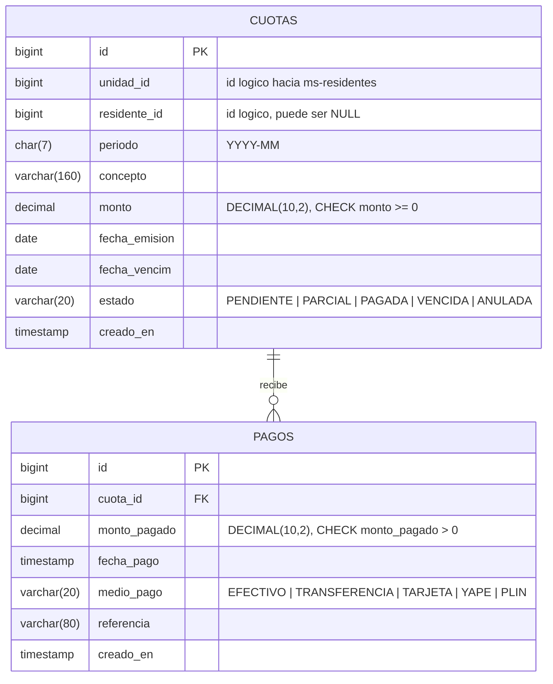

# Diagrama Entidad-Relacion — ms-pagos

Base: **MySQL 8** · `condominio_pagos`

## Relaciones

| Desde | Hacia | Cardinalidad | Clave foranea |
|-------|-------|--------------|---------------|
| `cuotas` | `pagos` | 1 a N | `pagos.cuota_id` (`fk_pagos_cuota`) |

Una cuota puede recibir **varios pagos**: asi se representan los abonos
parciales, donde el residente cancela su deuda en partes. El estado `PARCIAL`
de la cuota existe justamente para ese caso.

Esta relacion es la que cumple el requisito del curso de tener al menos dos
tablas relacionadas por base SQL.

## Restricciones

- `cuotas`: `UNIQUE (unidad_id, periodo, concepto)` — no se puede emitir dos
  veces la misma cuota de un mes a la misma unidad.
- `cuotas.monto`: `CHECK (monto >= 0)`.
- `pagos.monto_pagado`: `CHECK (monto_pagado > 0)` — un pago de cero no es un
  pago.
- Indices en `cuotas.unidad_id`, `cuotas.estado`, `pagos.cuota_id` y
  `pagos.fecha_pago`, que son las columnas por las que mas se filtra.

El saldo pendiente de una cuota no se guarda en una columna: se calcula como
`monto - SUM(pagos.monto_pagado)`. Guardarlo obligaria a mantenerlo
sincronizado en cada insercion, con el riesgo de que quede desfasado.

## Frontera con los otros microservicios

`unidad_id` y `residente_id` son **identificadores logicos** hacia
`ms-residentes`: no hay clave foranea ni llamada HTTP a ese microservicio. Son
bases distintas, en motores distintos, y MySQL no puede verificar una
referencia que esta fuera de su alcance.

El cruce entre bases lo resuelven **ms-ficha-residente** (en linea, consultando
a cada microservicio) y **Athena** (en diferido, sobre los datos ya volcados a
S3).

El DDL completo esta en [schema.sql](schema.sql), y las entidades JPA que lo
implementan en `src/main/java/pe/edu/utec/condominio/pagos/model/`.
